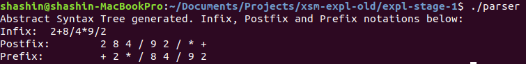

# EXPL NITC - Roadmap Stage 1

## Task
Given a simple mathematical expression as input, in infix notation - perform the following tasks:

1. Define a grammar to capture the definition of the expression
2. Parse the given input string according to this grammar
3. Build an Abstract Syntax Tree
4. Traverse this AST and form the infix, prefix and postfix notations of the given expression
5. Use the AST to generate intermediate code targeting the XSM platform

## Input

In the form of a text file "input.txt" containing the following example:
>2+(8/4)*(9/2)

## Build
Run the following commands:
>yacc -d parser.y
>lex lexer.l
>gcc -o parser lex.yy.c y.tab.c tree.c

## Execute
Run the following command:
>./parser

## Output
Following are the output artifacts:
1.  
2. a "target.xsm" executable file that contains the generated intermediate code corresponding to the input
3. The target.xsm can be run on the XSM simulator to yield the evaluated output.

## Learning
1. Lex and Yac syntax and usage
2. Grammar Definition
3. Compile-time data structures
4. Intermediate Code Generation
5. Rudimentary register management
