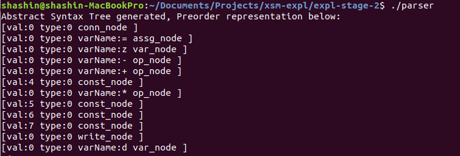
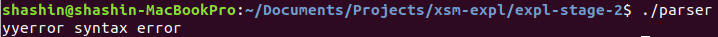

# EXPL NITC - Roadmap Stage 2

## Task
Given a basic EXPL program (refer definition)
1. Define a grammar to capture the definition of the expression
2. Parse the given input string according to this grammar
3. Build an Abstract Syntax Tree
4. Traverse this AST and form the infix, prefix and postfix notations of the given expression
5. Use the AST to generate intermediate code targeting the XSM platform

## Input

In the form of a text file "input.txt" containing the following example:
```
    begin
      z = 4+5*6-7;
      write(z); 
    end;
```
## Build
Run the following commands:
```
yacc -d parser.y
lex lexer.l
gcc -o parser lex.yy.c y.tab.c tree.c
```
## Execute
Run the following command:
```
./parser
```

## Output
Following are the output artifacts:
1. a printed form of the generated AST\
 
2. a "target.xsm" executable file that contains the generated intermediate code corresponding to the input
3. The target.xsm can be run on the XSM simulator to yield the evaluated output.

## Learning
In addition to Stage 1 learnings:
1. Advanced grammar definition, capable of capturing the definition of EXPL
2. Syntax checking. If the input were to be:
```
    begin
      z = 4+5*6-7 <--missing semicolon here
      write(d); 
    end;
 ```

The parser should be able to capture this:\
 \
3. Static Storage Allocation. The input program has a variable "z". On the EXPL platform, such variables are statically allocated to one of 26 memory locations starting from 4096 (each corresponding to one alphabetical variable)
